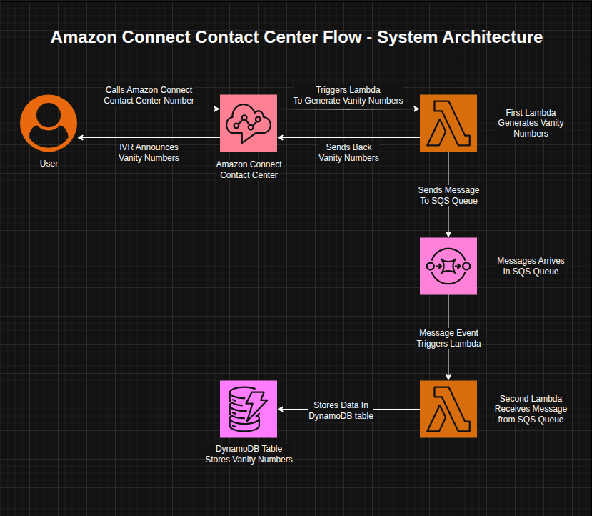
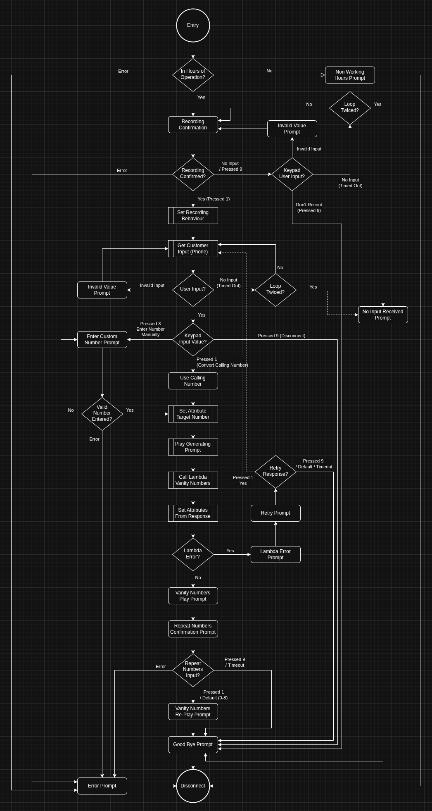
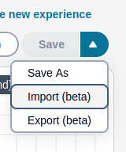
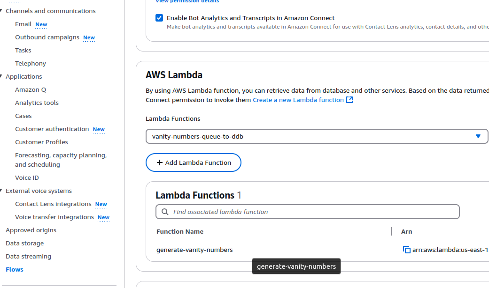
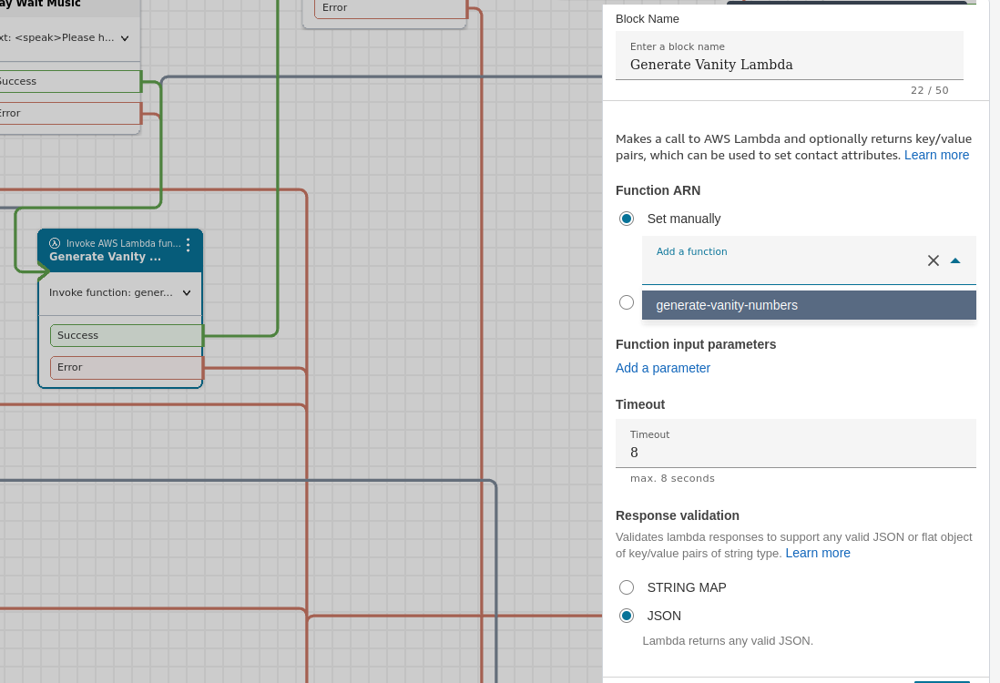

# Amazon Connect Conatact Flow Implementation Demonstration
A project demonstrating the implementation of Amazon Connect Contact Center Flow and Integration with Lambda, SQS, and DynamoDB.

## Overview
This repository contains an implementation of an **Amazon Connect Contact Flow** integrated with **AWS Lambda** and **DynamoDB** to generate vanity numbers based on the caller's number or a custom number input by them. 
The flow allows for DTMF and IVR interactions with users (callers) based on the Contact Flow, get's user's inputs, generates vanity numbers from their cell or manually entered number, and stores customer's phone number in **DynamoDB** table.

## Features

- **Amazon Connect Flow**: Configure a call flow to interact with customers.
- **Lambda Logic**: Use AWS Lambda to generate vanity numbers and store in DynamoDB.
- **SQS Queue**: Decouple the lambda functionalities by using an SQS queue.
- **DynamoDB Integration**: Store generated vanity numbers along with other information.

## System Architecture Design



The architecture builds upon the requirements and expands the scope using:

1. **Amazon Connect** - A cloud-based contact center service provided by Amazon.
2. **AWS Lambda** - Two serverless functions to generate vanity numbers and store data in DynamoDB table, respectively.
3. **Amazon DynamoDB** - NoSQL tabular database for storing information, like caller number and generated vanity number.
4. **AWS SQS** To implement a decoupled architecture, the solution expands upon the scope and uses an SQS messaging queue and leverages two distinct **AWS Lambda** functions to achieve the objectives.

### Design Motivations

This design decoupling mimics a production implementation to handle the two tasks separtely - generating & returning vanity numbers and storing them in DynamoDB.

1. **Lambda vanity-to-sqs**: The first Lambda function is called by Amazon Contact Center and generates vanity numbers from either the caller's number or a manully entered number, sends the numbers to SQS queue, and returns them to the Amazon Contact flow for announcement by IVR.
2. **Lambda sqs-to-ddb**: The second Lambda function is triggered by the SQS queue whenever a new message enters the queue and stores this information into the DynamoDB table. 

## Contact Flow

### Contact Flow Overview

The following points provide a brief overview of the way the flow will work.

- **User Call**: When a customer calls into Amazon Connect, the contact flow begins.
- **User Input**: The IVR presents multiple prompts along with input opportunities to the user. They can use their current phone number or a custom number to generate vanity numbers.
- **1st Lambda Invocation**: The contact flow triggers an AWS Lambda function to generate vanity numbers based on the **target phone** number, which can be either the user's number or the number they enter manually. The function generates the vanity numbers, sends them to SQS queue, and also returns them to Amazon Connect, where they are announced by the IVR to the user.
- **SQS Message**: Receives the message from the first Lambda function and uses **Lambda Triggers** to trigger the second lambda function. The messagethat contains:
   1. **Phone Number (String)**: Customer's phone number that was used to place the call.
   2. **Target Number (String)**: The phone number to be converted, can be the same as customer's phone number.
   3. **Timestamp (String)**: The timestamp when the vanity numbers were generated.
   4. **Vanity Numbers (Object)**: An object containg the five generated vanity numbers.

- **2nd Lambda Invocation**: The second Lambda is triggered whenever a message is recevied in the SQS queue (Lambda Triggers Event Source Mapping). It adds an ID to the message and stores the data into the DynamoDB table.
- **DynamoDB Table**: Lambda stores the data from the SQS queue in the DynamoDB table.

### Flow Chart for User Interactions During Contact Flow 

The following flow chart provide a view of the contact flow from a user's perspective for easier understanding:



### Contact Flow Diagram

The contact flow can be seen in the following compiled image. A JSON file for the contact flow is also available in the repository under the **contactflow** folder.


## Vanity Number Generation

### 1. Package Used 

`Word-List` is the library used to check for valid english words. It contains around `275,000` english words. They are saved in the `wordset.json` file which is available inside the lambda zipfile. The words in it have a minimum of `2 alphabets each`.

### 2. Conversion

Only the last `7 digits` of a number are converted to generate a vanity numbers.

*Note: The vanity number generation process needs to be improved. I was working on trying different mechanism for generation of vanity numbers. Due to a lack of time, I just clubbed them together.*


### 2.a) **First Generation Function**: 
The first function shown by the following code generates all possible `7-digit` combinations by converting digits to alphabets. The generated words are filtered based on which of the words are available in the wordset.

```
const cartesian = (arr: string[][]): string[][] => {
  return arr.reduce<string[][]>(
    (a, b) => a.flatMap((d) => b.map((e) => [...d, e])),
    [[]]
  );
};

// Generate all letter combinations from a phone number
const generateAllFullLengthCombinations = (digits: string): string[] => {
  const chars = digits.split("").map((d) => digitToLetters[parseInt(d)] || []);
  return cartesian(chars).map((arr) => arr.join(""));
};
```

### 2.b) **Second Generation Function**: 

If we don't have 5 words, we call the second function. 

```
// Find matches with sliding window that may have a lower word count
const findSlidingMatches = (
  combinations: string[],
  wordlist: Set<string>,
  windowSize: number,
  matches: Set<string> = new Set(),
  number: string
): Set<string> => {
  if (windowSize > 1) {
    for (const word of combinations) {
      for (let start = 0; start <= word.length - windowSize; start++) {
        const prefix = word.slice(0, start) ?? null;
        const subWord = word.slice(start, start + windowSize);
        const suffix = word.slice(start + windowSize) ?? null;

        if (wordlist.has(subWord)) {
          matches.add(
            `${
              prefix && wordlist.has(prefix) ? prefix : number.slice(0, start)
            }${subWord}${
              suffix && wordlist.has(suffix)
                ? suffix
                : number.slice(start + windowSize)
            }`
          );
        }
        // Replace zeros with alphabet 0 and one with alphabet I
        if (/[01]/.test(word)) {
          const replacedWord = replaceZeroAndOne(word);
          const prefixIO = replacedWord.slice(0, start) ?? null;
          const subWordIO = replacedWord.slice(start, start + windowSize);
          const suffixIO = replacedWord.slice(start + windowSize) ?? null;

          if (wordlist.has(subWordIO)) {
            matches.add(
              `${
                prefixIO && wordlist.has(prefixIO)
                  ? prefix
                  : number.slice(0, start)
              }${subWord}${
                suffix && wordlist.has(suffixIO)
                  ? suffix
                  : number.slice(start + windowSize)
              }`
            );
          }
        }
      }
    }    
    return findSlidingMatches(combinations, wordlist, windowSize - 1, matches, number);
  } else {
    return matches;
  }
};
```

Its working is explained in the folowing steps.
   

- It loops through all words in `combinations`.
- For each `word`, it slides a window of size `windowSize` across it ranging from `6` to `2`, meaning it can find sub-words that can have 2 to 6 alphabets. If there are any alphabets before the window, they are stored as the `prefix`. If there are any alphabets after the window, they are stored as the `suffix`. 
- For every substring (subWord) of that size:
   - If it's found in the wordlist, it's considered a match.
   - It attempts to reconstruct a new string:
      - If the prefix and suffix are also in the wordlist, use them.
      - Otherwise, use the digits from the original number.
   - Optionally, if the word has digits 0 or 1, we replace them with alphabets `O` and `I`, respectively, using `replaceZeroAndOne()`.
   - Try matching the transformed `subWordIO` in the wordlist.
      - If the replaced word exists, we add the original `subword`, `prefix`, or `suffix`, not the replaced words. e.g., ```9217217``` can become `9 AIR AIR` if `1` is replaced with `I`, and we can have the vanity number as ```xxx9A1RA1R```.
- It recursively repeats the above with smaller window sizes until windowSize == 1.

   #### Example 1
- E.g., if we have a word `AHELLOX` from the last 7 digits of the phone number `2435569`:
   - We start with a `windowSize` of `6`, and can form the following words across two iterations of the loop:
      - **Iteration 1:** **AHELLO**: 
         - `prefix` = null;
         - `subWord`= AHELLO; 
         - `suffix`: X         
      - **Iteration 2:** **HELLOX**: 
         - `prefix`= A; 
         - `subWord`= HELLOX; 
         - `suffix`= null
   - We compared the `subWord` with the `wordset`. Neither of these are valid words present in the dictionary.
   - The `windowSize` decreases to size `5` and we form the following words across three iterations of the loop:
      - **Iteration 1:** **AHELL**: 
         - `prefix`= null; 
         - `subWord`= AHELL; 
         - `suffix`= OX         
      - **Iteration 2:** **HELLO**: 
         - `prefix`= A; 
         - `subWord`= HELLO; 
         - `suffix`= X
      - **Iteration 3:** **ELLOX**: 
         - `prefix`= AH; 
         - `subWord`= ELLOX; 
         - `suffix`= null
   - Here, **Interation 2**, `HELLO` is a valid word in `wordset`. Now as we have a positive match, we check if its `prefix`, ***A*** and `suffix`, ***X*** are also in the wordset.
      They will not be in the wordset because the wordset doesn't have single alphabet words.
   - We construct a new string based on: `prefix`= A; `subWord`= HELLO; suffix`= X`.
   - As the `prefix` and `suffix` are not present, hence we will use the original digits of the phone number for but the `subword` is present and we can use its alphabets:
      - **2HELLO9**
   - Using this our vanity phone number will be `xxx2HELLO9` where `xxx` represent the leading digits of the phone number.

   #### Example 2

   Let us consider another example wherein we have a phone number `xxx9932275`.
   - In this case, when we get to a `windowSize` of `4`, we will eventually end up with the following word:
      - **WYEBARK**
         - `prefix`= WYE; 
         - `subWord`= BARK; 
         - `suffix`= null
   - Both of the `prefix` and `subWord` will be present in the wordset.
   - So in this case, we do not convert the prefix to digits but use it as is, thereby having the vanity number `xxx WYE BARK`.

   #### Example 3

   Let us consider another example wherein we have a phone number `xxx9932175`.
   - In this case, when we get to a `windowSize` of `4`, we will eventually end up with the following word for the last 7 digits:
      - **WYEB1RK**
         - `prefix`= WYE; 
         - `subWord`= B1RK; 
         - `suffix`= null
   - The `subWord` as such will not be present.
   - However, the string contains `1` and it will be replaced with `I`. After replacement we convert `WYEB1RK` to `WYEBIRK`. We get the following condition:
      - **WYEBARK**
          - `prefixIO`= WYE; 
          - `subWordIO`= BIRK; 
          - `suffixIO`= null
   - Both of the `prefixIO` and `subWordIO` will be present in the wordset.
   - So in this case, we combine `prefix` and `subWord` to generate a vanity number `xxx WYE B1RK`. We still want to use the `prefix` and `subword` and not `prefixIO` and `subwordIO` because we need to keep the original digits `1` and `0`, when we return the number to user.

   #### Further Improvements

   1. Right now, the algorithm has a single window with a prefix and suffix.
   This algorithm can be further improved by using multiple sliding windows of 
   smaller sizes.   
      
### 2.c) **Third Generation Function**: 

If we still don't have enough vanity numbers, we use the following code to construct them randomly. It doesn't compare the generated words with the `wordset` and will only generate `5` maximum ranomized results.

```
const fallbackRandomLetters = (
  number: string,
  matches: Set<string>
): Set<string> => {
  while (matches.size < 5) {
    const word = number
      .split("")
      .map((d) => {
        const letters = digitToLetters[parseInt(d)] || [d];
        return letters[Math.floor(Math.random() * letters.length)];
      })
      .join("");
    matches.add(word);
  }
  return matches;
};
```
### 3. Determining Best Vanity Numbers

In order to determine the five best vanity numbers for a given number, the following code is used to sort the calculated vanity numbers in descending order based on the `number of alphabets in them`. 

```
// Count Alphabets in Vanity Number
const countAlphabets = (str: string): number => {
  return (str.match(/[A-Za-z]/g) || []).length;
};

// Sort Vanity Numbers based on the number of alphabets in them
const sortedVanityNumbers = (strings: string[]): string[] =>
  strings.sort((a, b) => countAlphabets(b) - countAlphabets(a));
```

The top five results with the most alphabets are returned using the following code and we prepend the leading digits of the phone number to them.
```
const filterFiveResultsAndPrepend = (
  vanityNumbersSet: Set<String>,
  leadingDigits: string
): string[] => {
  
  const setArray = [...vanityNumbersSet];
  
  const result = setArray.slice(0, 5).map((item) => `${leadingDigits}-${item}`);

  return result;
};
```


## Getting Started - Installation Instructions

To set up and run the project in your AWS account, follow these steps:

### Prerequisites

- **AWS Account**: You'll need an AWS account with access to Amazon Connect, Lambda, SQS, and DynamoDB services with associated IAM permissions.
- **Node.js**: Lambda function code is written in TypeScript & Node.js and node version ```22``` must be installed if you want to modify the functions or generate zip files for upload to AWS. Refer to the scripts in the ```package.json``` files for more information. ```npm``` is the package manager being used.

```
Note: We are assuming all AWS services being created are in the same region and same account. Please adjust permissions for cross-account services. Please check cross-region compatibility between services.
```


### 1. Set Up Amazon Connect

1. **Create an Amazon Connect instance**: Create an Amazon Connect Instance after logging in your AWS account. [Use the Module 1 of this tutorial provided by AWS for reference](https://catalog.workshops.aws/amazon-connect-introduction/en-US/module1). Ensure to specify an ***Admin User*** which you will need to log in to your Amazon Connect Instance to access its console.
2. **Set Queue and Routing Profiles**: Using the above tutorial, do the following for this step:
   - **Hours of Operation**: Set hours of operation or use ```Basic Hours```. Edit them as required. The contact center will be available during these hours.
   - **Create Queue**: Create one queue called ```Vanity Numbers``` and select the ***Hours of Operation*** for it. Select the one create in the previous step. Refer the to the previous tutorial for detailed steps but we only need one queue for this project whereas the tutorial creates two queues.
   - **Create Routing Profile**: Next, create a Routing Profile from the Connect instance console. 
      - Enter the ```Name``` of the routing profile.
      - For ```Channels```, check the checkbox next to voice. We are not using other channels for this project.
      - Under ```Queues```, add ```Vanity Numbers``` we just created.
      - You can select a ```Default outbound queue``` but our *Contact Flow* doesn't implement this feature.
   
   We don't need to set up ```Security Profiles or Users``` necessarily and can use the admin user.

3. **Create a Contact Flow**: Our next step is to create a ```Contact Flow``` in the Amazon Connect Console. We only need one contact flow unlike the tutorial link given above.
- Got to `Routing -> Flow` and then click `Create Flow`. `Import` the flow using the drop down menu on the top-right side of the screen and upload the `Vanity_Numbers.json` file located in the ***contactflow*** folder of this repository. It will create the `Vanity_Numbers` contact flow.
<br/><br/>
<div align="center">
  
</div>
<br/><br/>

```
Note: The import feature is still in beta and may not work properly. Manual adjustments may be required. 

If you encounter an error because the Lambda function is not yet created or available, then come back to this step after completing the rest of the steps.
```

4. **Claim Phone Number**: We need to claim a phone number that the users will call. 
 - Go to `Channels -> Phone Numbers -> Claim a number`.
 - Choose `Voice` and `DID (Direct Inward Dialing)`.
 - Select your respective `Country` from the list and choose a phone number.
 - Under the `Optional Information` section, select the `Vanity_Numbers` contact flow.
 - Click `Save` and the number will be assigned to your contact center. You can call this number to check if it is working. *`Charges may be applied`*.

### 2. Set Up DynamoDB Table

The next step is to create a DynamoDB table for storing the database.
   - Go to the DynamoDB console in your AWS account.
   - Click `Create Table`. Set the *partition key* and *table name* - we will use the latter to set up env variable for one of the lambda functions.
   - Table Name: `VanityNumbers` or similar.
   - Partition Key: `id` (string)
   - You can either leave default settings or provision DynamoDB based on custom configuration. I used `1RCU` and `1WCU` limit with no autoscaling, and it was sufficient for my use case.

### 3. Set Up SQS Queue

We need an SQS queue to transfer messages between the two lambda functions.
 - Go to the SQS console in your AWS account.
 - Click `Create Queue`.
 - Choose `Standard Queue` 
 - Enter a `Name` for the queue and click `Create Queue`.
 - We will add the `URL` of this SQS queue as an env variable for the first lambda.   

### 4. Set Up Lambda Functions

1. **Clone Repository**: Clone this GitHub repository on your machine.

2. **Generate Zip Files**: The next step is to generate the ```lambda .zip packages``` for deployment. We need to do this for both lambda functions.
   - **vanity-to-sqs**: From the terminal, go to the ```~/amazon-connect-implement/lambda/vanity-to-sqs``` folder and run ```npm run prepare-dist``` to generate the zip file ```lambda-gen-vanity.zip``` in the ```dist``` folder. 

   - **sqs-to-ddb**: From the terminal, go to the ```~/amazon-connect-implement/lambda/sqs-to-ddb``` folder and run ```npm run prepare-dist``` to generate the zip file ```lambda-sqs-to-ddb.zip``` in the ```dist``` folder.

3. **Set Up First Lambda function** 
   - Create the first Lambda function in your AWS console with ```Node.js 22.x``` as the runtime and upload the file ```lambda-gen-vanity.zip``` located at ```~/amazon-connect-implement/lambda/vanity-to-sqs/dist/``` to deploy the code. Ensure the option ```Create a new role with basic Lambda permissions``` is selected to create the **execution role** for it.

    - Add the env variable ```SQS_QUEUE_URL_VANITY_URL``` in this Lambda function and specify the ```URL``` of the SQS queue.

    - Edit the Lambda role that was create with this Lambda function to give the required permissions to access the **SQS QUEUE**. Use ```Allow: sqs:*``` or select individual permissions as required.

4. **Set Up Second Lambda function** 

      ```
        This Lambda must have 256MB of memory instead of the minimum 128MB for it to function properly as it loads the json wordset. Please make this change when creating the Lambda function.
      ```

    - Create the second Lambda function in your AWS console with ```Node.js 22.x``` as the runtime and upload the file ```lambda-sqs-to-ddb.zip``` located at ```~/amazon-connect-implement/lambda/sqs-to-ddb/dist/``` to deploy the code.  Ensure the option ```Create a new role with basic Lambda permissions``` is selected to create the **execution role** for it.

    - Add the env variable ```TABLE_NAME``` in second Lambda function and specify the ```Name``` of the DynamoDB table.

    - Edit the Lambda role that was create with second Lambda function to give the required permissions to access the **DynamoDB Table** and the **SQS QUEUE**. Use ```Allow: dynamodb:*``` and ```Allow: sqs:*```, respectively, or choose permissions as required.
    
    - Create a **Lambda Trigger** either from the Lambda function or the SQS queue and select the queue or (the Lambda function if creatig in SQS queue) so that this Lambda function is triggered when the SQS queue receives a message.


### 5. Link Lambda Function To Amazon Connect Contact Flow
The next step is to link the first Lambda function `lambda-vanity-to-sqs` to the Amazon Connect queue.

1. **Add Lambda To Amazon Connect Flow**: We need to allow the Amazon Connect instance to access the lambda function.
   - **Add Lambda**: Go to the Amazon Connect service console in your AWS account (not in the Connect instance account).
   - **Select Instance**: Select your Amazon Connect instance.
   - **Select Flows**: Choose `Flows` by expanding the left navigation pane.
   - **Select Lambda**: Scroll down to the AWS Lambda section and select the first lambda function and click `Add Lambda Function`. Confirm if the ARN of the function is added.



2. **Use Lambda In Connect Flow** Once the Lambda function is added to the Amazon Connect instance flow, we can use it in the Invoke Lambda block of the flow. The following operations are perform in the `Amazon Connect instance console`, not the AWS console.
- Importing the `Contact Flow` file would already have added the `Invoke AWS Lambda function` block. Ensure that the right function is selected from the drop-down list. 
- Make sure the `Response validation` is set to `JSON`, not `STRING MAP`, which is the default option.
- Click `Save` and `Publish` the flow.




## Troubleshooting
If there are any issues encountered, consider the following:
1. Check AWS CloudWatch logs to see what errors are being encountered in the logs.
2. See if all services have the appropriate permissions in their service roles.

In case of any other issues, please refer to AWS documentation.


## Challenges Overcome

Here are some of the challenges that I overcame during the development of this project:

1. **Working With Amazon Connect**: Although I have worked with AWS before, it is my first time working with Amazon Connect and I had to learn the service and its implementation. AWS documentations helped me fasttrack the process and I must admit I started having fun with the project and further expanded the scope of the project.

2. **Designing Contact Flow**: Desining a contact flow that mimicked a real-world user experience was another interesting part of the aspect. While the scope only required me to return the vanity number based on the calling number, I enhanced the functionality by providing multiple interaction opportunities for the user. They can:
   - Acknowledge that the call is being recorded or choose to disconnect.
   - Enter a number manually instead of using the one they are calling from if they want
   - Can choose to announce the returned vanity numbers again.
   - The flow is also modified to handle incorrect inputs or handle timeouts.

3. **Data Type Issues**: I faced a unique challenge when returning JSON data from the lambda function, wherein the returned object contained a boolean field. I wanted to use this for determining success or failure conditions and announce the appropriate attribute. But the Contact Flow attributes only accept strings and I was passing boolean in the JSON object. It was a bit tricky to figure this out and pass ```ssmlError``` as string instead of boolean.


## Production Improvements

A few improvements that I would have implemented if I had more time include:
1. **Add more Unit and Integration Tests**: The first thing I would add are more unit and integration tests and follow a Test-Driven-Development (TDD) approach. Right now only the second Lambda function that takes message from the SQS queue and stores its data to DynamoDB has tests. I would add tests for the first lambda function and more tests for the second one.

2. **Add DLQ SQS Queue and Deduplication**: I would definitely add a **DLQ SQS queue** to store any SQS messages that are not processed to prevent the loss of message and allow for better troubleshooting. Deduplication to avoid processing messages twice is another consideration that can be achieved either through a FIFO SQS queue or by checking if the table already has the data.

3. **Improve Vanity Generation Code**: The code that used to generate vanity numbers is not efficient and I did want to work on it further, improving the results returned and reducing time complexity.

4. **Add Logging**: The solution doesn't have logging capability beyond CloudWatch and adding the same is something that is essential in production.

5. **Integrate Amazon Lex**: Although this was beyond the scope of the project, integrating Amazon Lex would improve the project further as it would allow for human speech recognition and natural language processing.

6. **IaC Template**: Right now the depoyment process is manual. I would have created a CloudFormation or Terraform Template to automate the deployment process.

7. **Add Loops in Contact Flow**: When checking for invalid values, the contact flow currently repeats untill a user does not enter a correct value. A loop or check could be added to limit these invalid interactions.